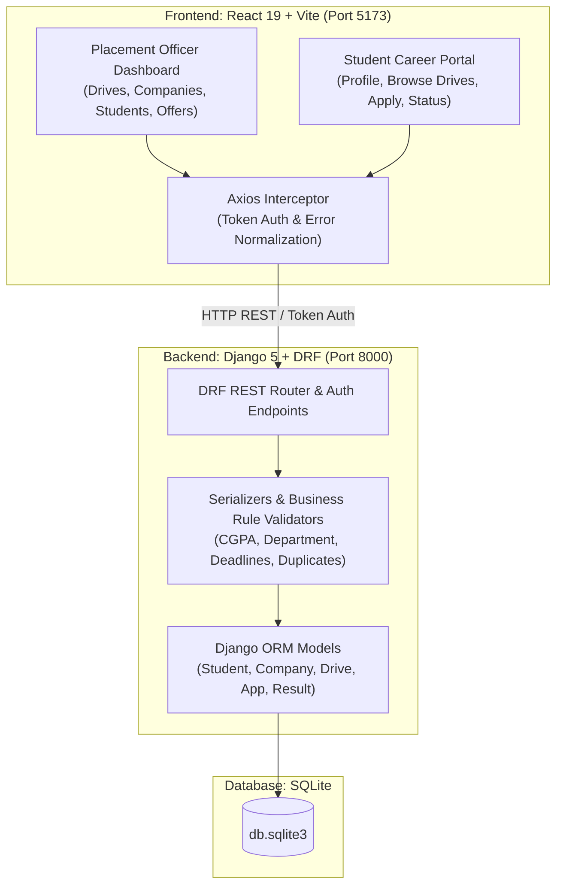
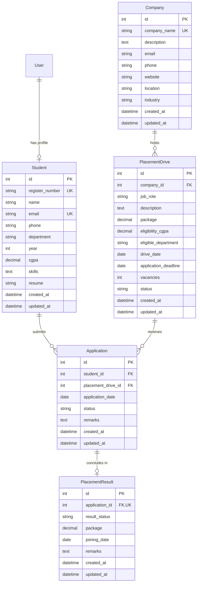

# Campus Placement Management System

A full-stack, CRUD-based **Placement Management System** developed for academic campus placement cells and undergraduate engineering students. Built with a decoupled **React.js** single-page frontend, **Django REST Framework (DRF)** backend, and a real **SQLite** relational database.

---

## 1. System Overview & Architecture

The system provides a role-based portal connecting the **Placement Officer (Admin)** and **Enrolled Candidates (Students)** to manage campus recruitment drives, student profiles, eligibility validation, applications, and official offer records.



---

## 2. Main User Roles & Features

### 🎓 Student Role
- **Self-Service Registration & Authentication**: Register with roll number, name, branch, phone, email, CGPA, and secure password. Supports login using register number, email, or username.
- **Student Profile Management**: View and update contact details, CGPA, skills, and portfolio/resume links with instant client-side validation.
- **Partner Companies Catalog**: View recruiting companies, industry domains, headquarters, recruiter contacts, official careers websites, and all scheduled placement drives.
- **Recruitment Drive Portal**:
  - Filter drives by status (`Upcoming`, `Ongoing`, `Completed`).
  - Search by role, company, or tech stack.
  - **Drive Details**: Inspect in-depth job descriptions, vacancies, timelines, and clear automated eligibility evaluations (CGPA & branch qualification).
  - **One-Click Apply**: Submit an application directly for eligible active drives with custom remarks.
- **Application Tracking Pipeline**:
  - Track application progression across recruitment stages: `Applied` ➔ `Shortlisted` ➔ `Interview` ➔ `Selected` / `Rejected`.
  - Inspect placement officer feedback and remarks.
  - **Withdraw Application**: Self-service option to withdraw/delete pending applications before the drive deadline.
- **Placement Results**: View official offers, package (in LPA), expected date of joining, and placement cell remarks.

### 🛡️ Admin / Placement Officer Role
- **Real-Time Analytics Dashboard**: Total registered students, recruiting companies, active drives, total applications, placed candidates, placement percentage, highest and average CTC (LPA), and branch-wise placement breakdown.
- **Student Management (CRUD)**: Create, Read, Update, Delete students with search and department filtering.
- **Company Management (CRUD)**: Manage recruiting partners, domains, contacts, and view active drives hosted by each company.
- **Placement Drive Management (CRUD)**: Schedule and update recruitment drives with package, minimum CGPA, eligible branches, drive date, deadline, vacancies, and status.
- **Application Review & Stage Transitions**: Filter applications by company, role, student, or stage; update applicant status from `Applied` to `Shortlisted`, `Interview`, or `Selected`/`Rejected`.
- **Placement Results Management (CRUD)**: Record official CTC offers, joining dates, and congratulatory notes for selected candidates.

---

## 3. Technology Stack

| Layer | Technology | Details |
|---|---|---|
| **Frontend UI** | React 19, JavaScript (ES6+), HTML5, Vanilla CSS | Fast SPAs, modern glassmorphism UI, responsive sidebar |
| **Icons & Design** | Lucide React | Clean, professional UI icons |
| **HTTP Client** | Axios 1.x | Configured with token authentication interceptors |
| **Routing** | React Router v7 | Protected role-based route guards (`/admin/*`, `/student/*`) |
| **Backend API** | Python 3.14, Django 5.x, Django REST Framework | ModelViewSets, Token Auth, atomic transactions |
| **CORS Middleware**| django-cors-headers | Enabled for local cross-origin communication |
| **Database** | SQLite3 (`db.sqlite3`) | Relational database with foreign keys and unique constraints |
| **API Testing** | Python test client & Postman Collection | Automated 16-test suite verifying CRUD & business constraints |

---

## 4. Database Models & Schema

The relational database schema enforces academic business logic and prevents duplicate applications:



### Critical Constraints
1. **Duplicate Application Prevention**: `unique_together = ('student', 'placement_drive')` ensures a candidate can apply only once per drive.
2. **One Result Per Application**: `OneToOneField(Application, related_name='result')` ensures clean 1-to-1 offer mapping.
3. **Range Validation**: CGPA is constrained to `0.00 <= CGPA <= 10.00`, vacancies `vacancies >= 1`, and package `package > 0.00`.

---

## 5. Quick Start & Execution Guide

### Prerequisites
- Python 3.10+ installed
- Node.js 18+ and npm installed

### Step 1: Start Django Backend
Open a terminal in the project root:
```powershell
# Navigate to backend directory
cd backend

# Install Python requirements
pip install -r requirements.txt

# Run database migrations
python manage.py migrate

# Seed demo dataset (creates demo admin, students, companies, drives, and results)
python manage.py seed_data

# Run the Django REST server
python manage.py runserver 127.0.0.1:8000
```
Backend API will be live at: `http://127.0.0.1:8000/api/`

---

### Step 2: Start React Frontend
Open a second terminal in the project root:
```powershell
# Navigate to frontend directory
cd frontend

# Install dependencies (if not already installed)
npm install

# Start Vite dev server
npm run dev
```
Open your browser at: `http://localhost:5173/`

---

## 6. Default Demo & Viva Accounts

The built-in `python manage.py seed_data` script prepares demo credentials with pre-filled applications:

| Role | Username / Identifier | Password | Access Rights |
|---|---|---|---|
| **Placement Officer (Admin)** | `admin` | `admin123` | Full administrative control, all 5 CRUD modules, status updates, analytics |
| **Student (Eligible Candidate)** | `21IT001` | `student123` | Student Dashboard, browse drives, apply, track status, view offer |
| **Student (Alternative Candidate)** | `21CS015` | `student123` | View drives, test eligibility boundaries, submit applications |

*(Note: The login page includes quick autofill buttons for both Admin and Student demo accounts for fast examiner demonstration).*

---

## 7. REST API Endpoints Summary

| Method | Endpoint | Description | Access |
|---|---|---|---|
| `POST` | `/api/auth/login/` | Authenticate user & issue Token | Public |
| `POST` | `/api/auth/register/` | Self-register student account | Public |
| `GET` | `/api/auth/me/` | Fetch current authenticated user session | Authenticated |
| `GET` | `/api/dashboard/stats/` | Fetch placement KPIs & metrics | Public / Authenticated |
| `GET`, `POST` | `/api/students/` | List or register student records | Authenticated / Admin |
| `GET`, `PATCH`, `DELETE` | `/api/students/<id>/` | View, update, or remove student | Authenticated / Admin |
| `GET`, `PATCH` | `/api/students/profile/` | Fetch or update own student profile | Student Authenticated |
| `GET`, `POST` | `/api/companies/` | List or add partner recruiting companies | Authenticated / Public |
| `GET`, `PATCH`, `DELETE` | `/api/companies/<id>/` | View, update, or remove company | Authenticated / Admin |
| `GET`, `POST` | `/api/drives/` | List or schedule placement drives | Authenticated / Public |
| `GET`, `PATCH`, `DELETE` | `/api/drives/<id>/` | View, update, or delete drive | Authenticated / Admin |
| `POST` | `/api/drives/<id>/apply/` | One-click student drive application | Student Authenticated |
| `GET`, `POST` | `/api/applications/` | List or submit drive applications | Authenticated |
| `GET`, `DELETE` | `/api/applications/<id>/` | View or withdraw application | Authenticated |
| `PATCH` | `/api/applications/<id>/update_status/` | Advance application stage | Admin Authenticated |
| `GET`, `POST` | `/api/results/` | List or record final placement offers | Authenticated |
| `GET`, `PATCH`, `DELETE` | `/api/results/<id>/` | View, modify, or delete placement result | Authenticated / Admin |

---

## 8. Verification & Test Suite

Run the automated backend test suite verifying 16 test cases:
```powershell
cd backend
python test_api_endpoints.py
```
Output:
```
==================================================
RUNNING BACKEND REST API & VALIDATION VERIFICATION
==================================================
[PASS] 1. Admin Login: Token generated, Role: admin
[PASS] 2. Student Login: Authenticated 21IT001, Role: student
[PASS] 3. Dashboard Stats: Students=8, Companies=5, Drives=5, Placed=3 (37.5%)
[PASS] 4. Student CREATE: Registered student successfully
[PASS] 5. Student READ & SEARCH: Retrieved by ID and query
[PASS] 6. Student UPDATE: Updated CGPA
[PASS] 7. Student DELETE: Successfully deleted test student
[PASS] 8. Student VALIDATION: Correctly rejected CGPA 12.50 (400 Bad Request)
[PASS] 9. Company CREATE: Added partner company
[PASS] 10. Placement Drive CREATE: Scheduled drive with eligibility
[PASS] 11. Application ELIGIBILITY VALIDATION: Blocked student with low CGPA
[PASS] 12. Application CREATE: Student applied for Drive
[PASS] 13. Duplicate Application PREVENTION: Blocked duplicate with 400 Bad Request
[PASS] 14. Application STATUS UPDATE: Changed status to Selected
[PASS] 15. Placement Result CREATE: Recorded final CTC offer
[PASS] 16. Cascade Cleanup: Test company and associated records removed cleanly
==================================================
ALL 16 BACKEND API & VALIDATION TESTS PASSED 100%!
==================================================
```

---

## 9. Academic Viva Voce FAQ

**Q1: Why did you choose Django REST Framework with React rather than Django Templates?**  
**Ans**: Decoupling the frontend (React SPA) and backend (DRF) follows modern industry standard microservice and client-server architecture. The backend exposes stateless REST APIs that can serve web apps, mobile apps, or third-party integrations, while React delivers a responsive UI without full page reloads.

**Q2: How is the duplicate application restriction implemented?**  
**Ans**: At the database level, the `Application` model specifies `unique_together = ('student', 'placement_drive')`. Additionally, the DRF `ApplicationSerializer.validate()` method checks `Application.objects.filter(student=student, placement_drive=drive).exists()` to reject duplicate requests with an informative `400 Bad Request`.

**Q3: How are eligibility requirements enforced?**  
**Ans**: Both client-side and server-side:
1. **Frontend**: Drives check the student's CGPA and branch against `drive.eligibility_cgpa` and `drive.eligible_department`. Ineligible students see a disabled "Ineligible" button with clear reasons.
2. **Backend**: `ApplicationSerializer.validate()` verifies `student.cgpa >= drive.eligibility_cgpa`, branch matching, that the deadline date has not passed, and that drive status is neither `Completed` nor `Cancelled`.

**Q4: How does authentication work between React and Django?**  
**Ans**: The system uses DRF Token Authentication (`rest_framework.authtoken`). On login, the server validates credentials and issues a cryptographic token. The React frontend stores this token in browser `localStorage` and an Axios request interceptor attaches it as `Authorization: Token <token>` on all subsequent requests.

**Q5: What happens if a company is deleted?**  
**Ans**: The `PlacementDrive` model defines `on_delete=models.CASCADE` on the foreign key to `Company`. Deleting a company safely cascades to remove its placement drives, associated student applications, and final placement results, maintaining referential integrity.
